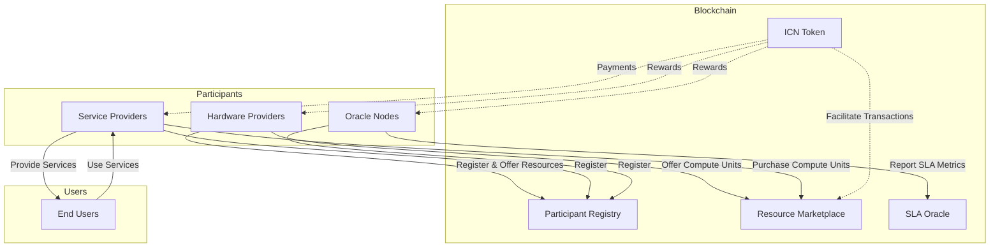
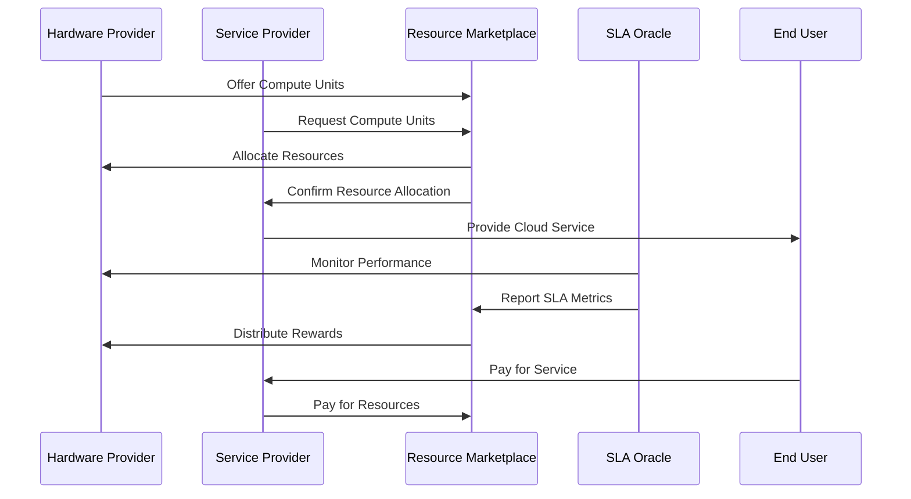

# Impossible Cloud Network (ICN)

## Table of Contents
1. [Project Overview](#project-overview)
2. [System Architecture](#system-architecture)
3. [Core Components](#core-components)
4. [Participants](#participants)
5. [Interaction Flow](#interaction-flow)
6. [Smart Contracts](#smart-contracts)
7. [Getting Started](#getting-started)

## Project Overview

The Impossible Cloud Network (ICN) is an innovative decentralized cloud ecosystem designed to disrupt the traditional cloud services market. By leveraging blockchain technology and decentralized networks, ICN aims to create a more open, efficient, and cost-effective alternative to centralized cloud giants.

ICN's key features include:
- Decentralized hardware provisioning
- Token-based incentive mechanism
- Service Level Agreement (SLA) monitoring
- Resource marketplace for compute units

## System Architecture

The following diagram illustrates the high-level architecture of the Impossible Cloud Network:



## Core Components

### 1. ICN Token (ICNT)

The ICN Token (ICNT) is the native utility token of the ecosystem. It's used for:
- Accessing network resources
- Rewarding hardware providers
- Compensating SLA Oracle nodes
- Facilitating transactions in the resource marketplace

### 2. Participant Registry

The Participant Registry manages the registration and status of different types of participants in the ICN ecosystem. It ensures that only verified and authorized entities can interact with the network.

### 3. Resource Marketplace

The Resource Marketplace is where Hardware Providers offer their compute resources and Service Providers purchase these resources. Pricing is determined through supply and demand, and transactions are facilitated using ICNT.

### 4. SLA Oracle Network

The SLA Oracle Network is responsible for monitoring and reporting on the performance and reliability of the network, playing a crucial role in maintaining the quality of service and trust within the ecosystem.

## Participants

ICN involves three main types of participants:

1. **Hardware Providers (HPs)**: Contribute computational resources to the network.
2. **Service Providers (SPs)**: Build and offer cloud services using the ICN infrastructure.
3. **SLA Oracle Nodes**: Monitor network performance and report on SLA metrics.

## Interaction Flow

The following diagram illustrates the typical interaction flow within the ICN ecosystem:



## Smart Contracts

The ICN ecosystem is powered by four main smart contracts:

1. **ICNToken.sol**: Implements the ERC20 token standard for ICNT, including minting functionality.
2. **ParticipantRegistry.sol**: Manages the registration and status of different participant types in the network.
3. **ResourceMarketplace.sol**: Facilitates the creation of resource offers by Hardware Providers and the purchase of these resources by Service Providers.
4. **SLAOracle.sol**: Handles the reporting and storage of SLA metrics for the network.

## Getting Started

To get started with ICN development:

1. Clone the repository:
   ```
   git clone https://github.com/your-username/icn.git
   cd icn
   ```

2. Install dependencies:
   ```
   npm install
   ```

3. Run tests:
   ```
   npx hardhat test
   ```

4. Deploy contracts (local network):
   ```
   npx hardhat run scripts/deploy.js --network localhost
   ```

For more detailed information on setup, testing, and deployment, please refer to our [Developer Documentation](link-to-dev-docs).

## Contributing

We welcome contributions to the Impossible Cloud Network! If you're interested in contributing, please check our [Contribution Guidelines](link-to-contribution-guidelines) for more information.

## License

This project is licensed under the MIT License - see the [LICENSE](LICENSE) file for details.